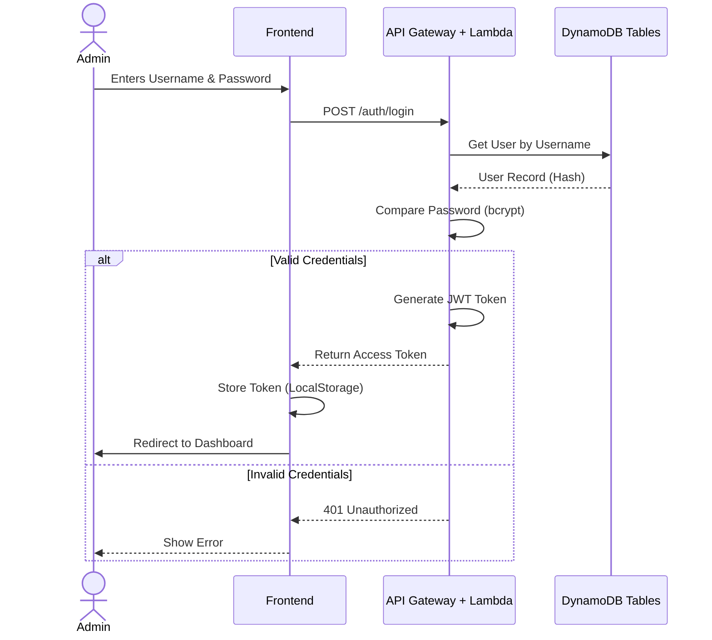
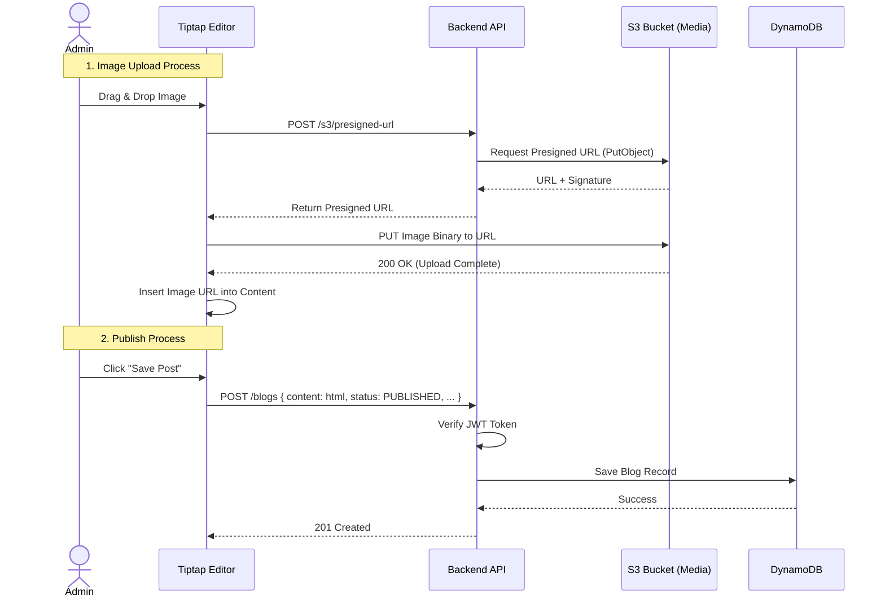

# 🏗️ System Architecture

This document outlines the architectural design of the Personal Blog Platform.

## 1. High-Level System Context

The system follows a **Serverless** architecture to minimize maintenance and cost while ensuring high scalability.

```mermaid
graph TD
    User((Reader))
    Admin((Admin/Author))

    subgraph "Frontend Layer"
        SPA[React SPA (Vite)]
    end

    subgraph "AWS Cloud"
        CF[CloudFront CDN]
        S3Frontend[S3 Bucket (Static Assets)]
        APIGW[API Gateway]
        Lambda[NestJS Lambda]
        DDB[(DynamoDB)]
        S3Media[S3 Bucket (Uploads)]
    end

    User -->|Visits| CF
    Admin -->|Visits| CF

    CF --> S3Frontend

    SPA -->|API Requests (REST)| APIGW
    APIGW --> Lambda

    Lambda -->|Store/Retrieve Content| DDB
    Lambda -->|Auth & User Content| DDB

    SPA -->|Upload Images| S3Media
    Lambda -->|Generate Presigned URLs| S3Media
```

---

## 2. Authentication Flow (JWT)

We use **JSON Web Tokens (JWT)** for stateless authentication. The `Users` table in DynamoDB stores the admin credentials (hashed).



---

## 3. Blog Publishing & Image Upload Flow

The platform supports rich text editing with image uploads. To reduce load on the Lambda function, direct S3 uploads via Presigned URLs are used.



---

## 4. Data Model (DynamoDB)

### Local Development vs Cloud

The data model remains the same, but the connection endpoint differs (`localhost:8000` vs `AWS Service Endpoint`).

#### **Table: Blogs**

Partition Key: `id` (UUID)

| Attribute  | Type   | Description                |
| :--------- | :----- | :------------------------- |
| id         | String | Unique Identifier (UUIDv4) |
| title      | String | Blog Title                 |
| content    | String | HTML Content (Sanitized)   |
| status     | String | `DRAFT` or `PUBLISHED`     |
| tags       | List   | Array of strings           |
| coverImage | String | S3 URL of the cover image  |
| createdAt  | String | ISO Timestamp              |
| updatedAt  | String | ISO Timestamp              |

#### **Table: Users**

Partition Key: `id` (UUID)

| Attribute | Type   | Description                 |
| :-------- | :----- | :-------------------------- |
| id        | String | Unique Identifier           |
| username  | String | Login username              |
| password  | String | Bcrypt hash of the password |
| createdAt | String | ISO Timestamp               |
