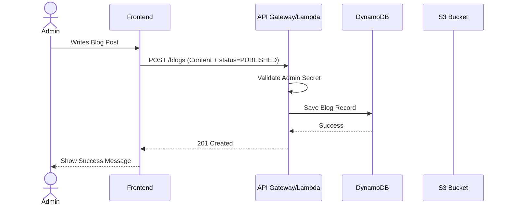

# Personal Blog Platform

> A Serverless Full-Stack Blog Platform built with React, NestJS, and AWS.

## 📖 Project Overview

This repository houses the source code for a personal blog platform designed to be scalable, cost-effective, and easy to maintain. It leverages a modern Serverless architecture on AWS.

### Tech Stack

| Component    | Technology      | Details                                                                              |
| ------------ | --------------- | ------------------------------------------------------------------------------------ |
| **Frontend** | React 19 + Vite | Typescript, TailwindCSS v4, Framer Motion. Hosted on S3 + CloudFront.                |
| **Backend**  | NestJS          | NodeJS runtime, wrapped in `serverless-express`. hosted on AWS Lambda + API Gateway. |
| **Database** | DynamoDB        | NoSQL database for flexible content storage.                                         |
| **Infra**    | Terraform       | Infrastructure as Code (IaC) for AWS resources.                                      |
| **CI/CD**    | GitHub Actions  | Automated build and deployment pipelines.                                            |

---

## ✨ Functionalities

### Public Features

- **Blog Listing**: View a list of published blog posts.
- **Blog Detail**: Read individual blog posts rendered from Markdown.
- **Responsive Design**: optimized for mobile and desktop.

### Admin Features

- **Secure Authentication**: Secret-key based login for admin access.
- **Markdown Editor**: Create and edit posts with a rich editor.
- **Status Management**: Save posts as `DRAFT` or publish them as `PUBLISHED`.
- **Image Upload**: Upload images directly to S3.

---

## 🏗️ Architecture

### System Architecture

```mermaid
graph TD
    User((User))

    subgraph "AWS Cloud"
        CF[CloudFront CDN]
        S3Web[S3 Bucket (Frontend)]
        APIGW[API Gateway]
        Lambda[Lambda Function (NestJS)]
        DDB[(DynamoDB)]
        S3Media[S3 Bucket (Uploads)]
    end

    User -->|HTTPS| CF
    CF --> S3Web
    User -->|API Calls| APIGW
    APIGW --> Lambda
    Lambda --> DDB
    Lambda --> S3Media
```

### Publishing Flow



---

## 🚀 Environment Setup

### Prerequisites

- [Node.js](https://nodejs.org/) (v18 or higher)
- [AWS CLI](https://aws.amazon.com/cli/) configured with your credentials.
- [Terraform](https://www.terraform.io/) installed.

### 1. Backend Setup

1.  Navigate to `backend` directory:

    ```bash
    cd backend
    ```

2.  Create a `.env` file with the following content:

    ```env
    AWS_REGION=ap-southeast-1
    DYNAMODB_ENDPOINT=http://localhost:8000
    BLOG_TABLE_NAME=Blogs
    AWS_ACCESS_KEY_ID=local
    AWS_SECRET_ACCESS_KEY=local
    ADMIN_SECRET=local-development-secret
    ```

3.  Install dependencies:

    ```bash
    npm install
    ```

4.  Run locally in development mode:

    ```bash
    # Ensure Docker is running
    docker-compose up -d
    ./scripts/setup-local-db.sh

    # Access Local Database GUI
    # Open http://localhost:8001 in your browser

    npm run start:dev
    ```

---

## 🧪 Testing

### 1. Automated Tests (Backend)

The backend includes both Unit and End-to-End (e2e) tests.

```bash
cd backend

# Run Unit Tests
npm run test

# Run E2E Tests
# Ensure your local DynamoDB is running first!
npm run test:e2e
```

### 2. Manual API Testing (cURL / Postman)

You can test the running local API at `http://localhost:3000`.

**Create a Blog Post:**

```bash
curl -X POST http://localhost:3000/blogs \
  -H "Content-Type: application/json" \
  -H "x-admin-secret: your_secret_key" \
  -d '{
    "title": "My First Post",
    "content": "Hello World!",
    "status": "PUBLISHED"
  }'
```

**Get All Blogs:**

```bash
curl http://localhost:3000/blogs
```

### 2. Frontend Setup

```bash
cd frontend
npm install

# Create a .env file
echo "VITE_API_URL=http://localhost:3000" > .env

# Run locally
npm run dev
```

### 3. Infrastructure Setup (Terraform)

```bash
cd terraform

# Initialize Terraform
terraform init

# Review changes
terraform plan

# Apply changes (deploys resources to AWS)
terraform apply
```

---

## 📦 Deployment

This repository uses **GitHub Actions** for automated deployments.

### Workflow

The deployment is split based on the directory changed:

1. **Frontend Changes** (`frontend/**`):
   - Builds the Vite app.
   - Syncs `dist/` folder to the S3 bucket.
   - Invalidates CloudFront cache.

2. **Backend Changes** (`backend/**`):
   - Builds the NestJS app.
   - Zips the artifact.
   - Updates the AWS Lambda function code.

### Required GitHub Secrets

To enable deployment, configure these secrets in your repository settings:

- `AWS_ACCESS_KEY_ID`: IAM User with permissions for S3, Lambda, and CloudFront.
- `AWS_SECRET_ACCESS_KEY`: Secret key for the IAM user.
- `AWS_REGION`: Target AWS Region (e.g., `ap-southeast-1`).
- `BACKEND_FUNCTION_NAME`: Name of the Lambda function (from Terraform output).
- `FRONTEND_BUCKET_NAME`: Name of the S3 bucket for frontend (from Terraform output).
- `CLOUDFRONT_DISTRIBUTION_ID`: ID of the CloudFront distribution.

---

## 👩‍💻 New Developer Guide

Welcome to the team! Here is how to start your Day 1:

1. **Clone the repo**: `git clone <repo-url>`
2. **Check the Infra**: Ask a team member for the `terraform.tfstate` location or ensure you have access to the remote state. If starting fresh, run `terraform apply` in the `terraform/` directory to create your own dev environment.
3. **Configure Local Env**:
   - Get the API Gateway URL from Terraform outputs (`terraform output api_endpoint`).
   - Set `VITE_API_URL` in `frontend/.env` to that URL (or your local backend URL).
4. **Start Coding**:
   - Run `npm run dev` in `frontend/` to work on UI.
   - Run `npm run start:dev` in `backend/` to work on API logic.

> **Tip**: Since the backend is Serverless, running it locally (`npm run start:dev`) works like a standard NestJS app. You don't need to emulate Lambda locally for most logic dev.
